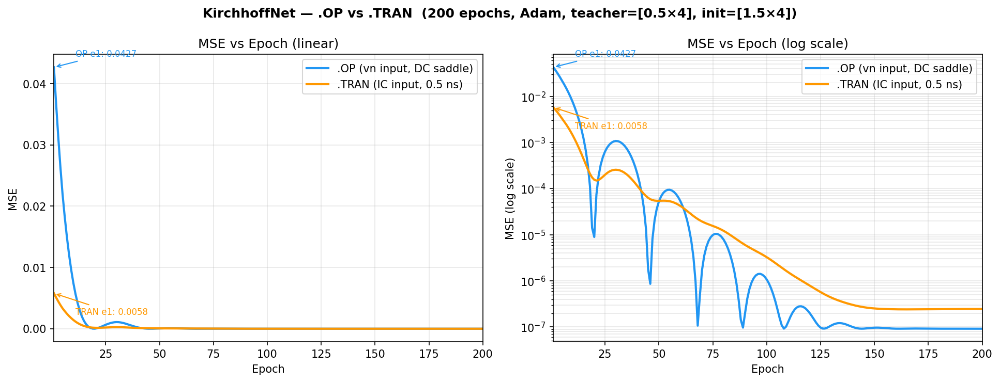
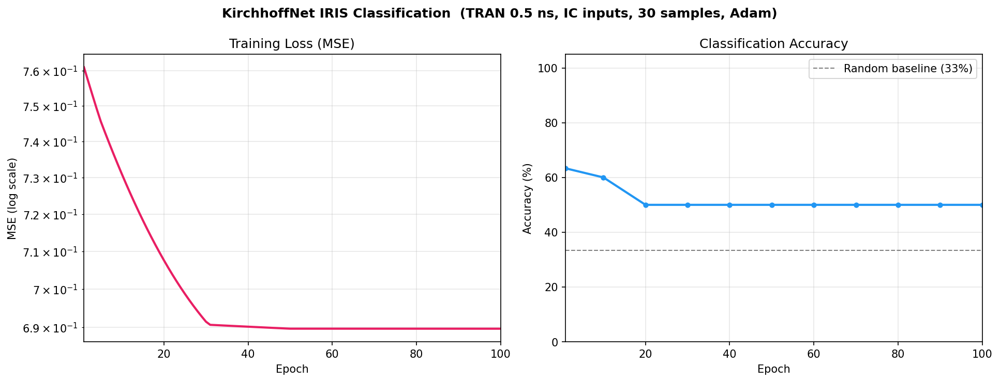

# KirchhoffNet — Circuit-Based Neural Network Training

A physical implementation of gradient-descent training using a SPICE circuit simulator instead of software automatic differentiation. Trainable parameters are PMOS gate bias voltages; the simulator computes both the forward-pass output voltage and the adjoint sensitivity (gradient) directly from circuit physics.

---

## Table of Contents

- [Overview](#overview)
- [Circuit Topology](#circuit-topology)
- [Trainable Parameters](#trainable-parameters)
- [Repository Structure](#repository-structure)
- [Branches](#branches)
- [Setup](#setup)
- [How to Run](#how-to-run)
- [Expected Inputs and Outputs](#expected-inputs-and-outputs)
- [Training Algorithm](#training-algorithm)
- [Results](#results)

---

## Overview

KirchhoffNet replaces software backpropagation with physical circuit simulation. The circuit is a 4-block differential-amplifier ring. Each block has a PMOS load whose gate voltage is the trainable weight (theta). The simulator finds the DC operating point or runs a short transient, then computes `dV(output)/dTheta` for each weight via sensitivity analysis. These sensitivities are used as gradients in Adam-optimised batch gradient descent.

**Key insight:** For a ring circuit, the DC saddle-point equilibrium (found by `.OP`) is analog and smooth — all 4 sensitivities are non-zero. A transient simulation (`.TRAN`) at 100 ns produces binary outputs (0.14 V or 3.3 V) because the ring latches in < 0.4 ns; those binary outputs have zero sensitivity. Two branches explore both approaches.

---

## Circuit Topology

```
     theta1 (V5)        theta2 (V4)        theta3 (V3)        theta4 (V2)
         |                  |                  |                  |
    +-[Block A]-+      +-[Block B]-+      +-[Block C]-+      +-[Block D]-+
    |  Diff Amp |      |  Diff Amp |      |  Diff Amp |      |  Diff Amp |
net4 -->  out=net6  net6 -->  out=net2  net2 -->  out=net3  net3 -->  out=net4
    +-----------+      +-----------+      +-----------+      +-----------+
                              ^
                         OUTPUT_NODE
```

**Ring:** `net4 -> Block A -> net6 -> Block B -> net2 -> Block C -> net3 -> Block D -> net4`

Each block is a differential pair with:
- Two NMOS transistors (NCH, L=650n, W=6u) sharing a tail-current source
- Two PMOS loads (PCH, L=2u, W=6u) with gates tied to the theta voltage source
- One tail-current NMOS (NCH, L=1u, W=12u) biased by `vbias = 2.7 V`

**Fixed supplies:**

| Signal | Value | Role |
|--------|-------|------|
| VDD    | 3.3 V | Supply rail |
| vbias  | 2.7 V | Tail-current bias |
| vn     | 1.0 V (default) | Differential reference input |

**MOSFET models:**

```spice
.MODEL NCH NMOS (VTO=0.536 KP=170e-6)
.MODEL PCH PMOS (VTO=-0.717 KP=40e-6)
```

PMOS threshold: `VDD - |VTP| = 3.3 - 0.717 = 2.583 V`. Thetas must stay **below 1.7 V** for all 4 PMOS loads to remain in the linear region and all 4 sensitivities to be non-zero.

---

## Trainable Parameters

| SPICE source | Python name | Controls      |
|-------------|-------------|---------------|
| V5          | theta1      | Block A PMOS gate |
| V4          | theta2      | Block B PMOS gate |
| V3          | theta3      | Block C PMOS gate |
| V2          | theta4      | Block D PMOS gate |

All thetas are constrained to `[0.1 V, 1.69 V]` during training.

---

## Repository Structure

```
kirchoff_claude/
|
|-- kirchoffnet_train.py      # Main training loop (branch-specific)
|-- netlist_generator.py      # Writes .OP and .TRAN SPICE netlists
|-- run_comparison.py         # Runs both approaches for 200 epochs each
|-- plot_comparison.py        # Generates OP vs TRAN comparison plot
|-- kirchoff_diffamp_new.txt  # Reference hand-written SPICE netlist
|
|-- dataset.json              # Auto-generated; regenerated if format changes
|-- training_log.csv          # Per-epoch MSE and theta values (written at end)
|-- op_log.csv                # OP approach log (from run_comparison.py)
|-- tran_log.csv              # TRAN approach log (from run_comparison.py)
|
|-- mse_curve.png             # MSE plot from kirchoffnet_train.py
|-- mse_comparison.png        # Side-by-side OP vs TRAN plot
|
|-- temp_netlists/            # Auto-generated SPICE files (gitignored)
```

---

## Branches

### `master` — DC Operating Point (`.OP`) approach

**How it works:**
- One `.OP` simulation per datapoint per epoch with `sensitivity=True`
- The simulator finds the DC saddle-point equilibrium analytically (Newton-Raphson, ~15 iterations)
- Returns `V(net2)` at the saddle point (analog, ~0.5–2.5 V) and `dV(net2)/dTheta_j` for all 4 thetas
- Input encoding: `vn` is varied from 0.5 V to 1.4 V across 10 datapoints; different `vn` values shift the ring's DC equilibrium to different output voltages
- All 4 sensitivities are non-zero because the DC saddle point sits in the analog linear region of all 4 PMOS loads

**Sensitivity values at thetas = [1.0, 1.0, 1.0, 1.0], vn = 1.0 V:**

| Parameter | dV(net2)/dParam |
|-----------|----------------|
| V5 (theta1) | -4.83e-03 |
| V4 (theta2) | +6.95e-04 |
| V3 (theta3) | -2.33e-01 |
| V2 (theta4) | +3.35e-02 |

**Dataset format (`dataset.json`):**
```json
[
  {"vn": 0.5, "target": 1.2341},
  {"vn": 0.6, "target": 1.3102},
  ...
  {"vn": 1.4, "target": 2.1876}
]
```

---

### `tran-sensitivity` — Transient (`.TRAN`) approach

**How it works:**
- One `.TRAN` simulation per datapoint per epoch with `sensitivity=True`
- Stop time is **0.5 ns** — before the ring latches to a binary rail (~0.4 ns switching time)
- Returns `V(net2)` at t = 0.5 ns (analog, transitioning) and `dV(net2)/dTheta_j` at the same instant
- Input encoding: 4 random IC voltages (one per ring node: net2, net3, net4, net6) sampled from `[0.2 V, 3.1 V]`
- Prediction and gradient are at the **same operating point** — the gradient directly minimises the TRAN loss

**Limitation:** At t = 0.5 ns, only Block B (V4/theta2) and partially Block A (V5/theta1) have had time to influence `net2`. Blocks C and D (V3/theta3, V2/theta4) are 2–3 ring hops away; their signals haven't propagated to `net2` yet. Effective gradients:

| Parameter | dV(net2)/dParam at t=0.5ns |
|-----------|---------------------------|
| V5 (theta1) | ~5e-06 (small) |
| V4 (theta2) | ~-5e-04 (active) |
| V3 (theta3) | ~8e-11 (~zero) |
| V2 (theta4) | ~-7e-09 (~zero) |

**Dataset format (`dataset.json`):**
```json
[
  {"ic": {"net2": 1.2, "net3": 2.8, "net4": 0.5, "net6": 3.1}, "target": 1.4821},
  ...
]
```

---

## Setup

**Requirements:**

- Python 3.8+
- `matplotlib`, `numpy`
- The SPICE circuit simulator at `D:\Simulator\circuit_simulator-main\src\main.py`

Install Python dependencies:
```bash
pip install matplotlib numpy
```

**Simulator path** is hardcoded in `kirchoffnet_train.py`:
```python
SIM_SRC = r"D:\Simulator\circuit_simulator-main\src"
```
Update this path if your simulator is installed elsewhere.

---

## How to Run

### Run the main training (master branch — OP approach)

```bash
git checkout master
python kirchoffnet_train.py
```

**What happens:**
1. If `dataset.json` does not exist, generates 10 targets by running the simulator with `TEACHER_THETAS = [0.5, 0.5, 0.5, 0.5]`
2. Trains from `TRAIN_THETAS = [1.5, 1.5, 1.5, 1.5]` for 500 epochs using Adam
3. Prints MSE and theta values every 10 epochs
4. Writes `training_log.csv` at completion
5. Prints final per-sample prediction vs target table

**Console output (sample):**
```
Generating dataset  teacher_thetas=[0.5, 0.5, 0.5, 0.5]
  sample  0: vn=0.5V  target=1.2341V
  ...
KirchhoffNet training  (OP-only: prediction + gradient from same call)
  Output node  : net2
  N datapoints : 10  |  Epochs: 500  |  LR: 0.05
  Init thetas  : [1.5, 1.5, 1.5, 1.5]
----------------------------------------------------------------------
Epoch    1  MSE=0.042686  T=[1.4500,1.5500,1.4500,1.5500]  sens=[-1.76e-03,+1.45e-04,-2.61e-01,+2.15e-02]
Epoch   10  MSE=0.007501  T=[1.0162,1.6900,1.0217,1.6900]  sens=[...]
...
Epoch  500  MSE=0.000000  T=[0.83,1.11,0.67,1.45]
```

---

### Run the TRAN approach (tran-sensitivity branch)

```bash
git checkout tran-sensitivity
python kirchoffnet_train.py
```

Same interface as master but uses `.TRAN 10p 0.5n` instead of `.OP`. Dataset uses random IC voltages; `dataset.json` is regenerated automatically if it contains the old `vn`-based format.

---

### Run both approaches for 200 epochs and compare (master branch)

```bash
git checkout master
python run_comparison.py
```

Runs `.OP` for 200 epochs first, then `.TRAN` for 200 epochs. Saves:
- `op_log.csv` — OP approach epoch log
- `tran_log.csv` — TRAN approach epoch log

Then generate the comparison plot:
```bash
python plot_comparison.py
```

Saves `mse_comparison.png`.

---

### Plot MSE from a completed training run

```python
import csv, matplotlib.pyplot as plt
epochs, mse = [], []
with open("training_log.csv") as f:
    for row in csv.DictReader(f):
        epochs.append(int(row["epoch"]))
        mse.append(float(row["mse"]))
plt.semilogy(epochs, mse); plt.xlabel("Epoch"); plt.ylabel("MSE"); plt.show()
```

---

## Expected Inputs and Outputs

### `kirchoffnet_train.py` (master / OP approach)

| Item | Value |
|------|-------|
| **Input per datapoint** | `vn` in V (float, range 0.5–1.4 V) |
| **Output per datapoint** | `V(net2)` at DC equilibrium (float, ~0.5–2.5 V) |
| **Teacher thetas** | `[0.5, 0.5, 0.5, 0.5]` V — generates ground-truth targets |
| **Training init** | `[1.5, 1.5, 1.5, 1.5]` V |
| **Epochs** | 500 |
| **LR** | 0.05 (Adam) |
| **Convergence** | MSE < 1e-6 by ~epoch 120 |
| **Outputs written** | `dataset.json`, `training_log.csv`, `temp_netlists/*.txt` |

### `kirchoffnet_train.py` (tran-sensitivity / TRAN approach)

| Item | Value |
|------|-------|
| **Input per datapoint** | 4 IC voltages: `{net2, net3, net4, net6}` each in `[0.2, 3.1]` V |
| **Output per datapoint** | `V(net2)` at t = 0.5 ns (float, analog transition value) |
| **Teacher thetas** | `[0.5, 0.5, 0.5, 0.5]` V |
| **Training init** | `[1.5, 1.5, 1.5, 1.5]` V |
| **Stop time** | 0.5 ns (before ring latches to binary rail) |
| **Epochs** | 500 |
| **LR** | 0.05 (Adam) |
| **Convergence** | MSE < 1e-6 by ~epoch 140 (only theta1/theta2 effectively updated) |
| **Outputs written** | `dataset.json`, `training_log.csv`, `temp_netlists/*.txt` |

### `run_comparison.py`

| Item | Value |
|------|-------|
| **Input** | None (self-contained) |
| **Epochs per approach** | 200 |
| **Outputs** | `op_log.csv`, `tran_log.csv` |
| **Runtime** | ~15–30 min (200 × 10 × 2 simulator calls per approach) |

---

## Training Algorithm

Both branches use the same MSE loss and Adam optimiser:

```
Loss:
  L = (1/N) * sum_i (v_pred_i - target_i)^2

Gradient (from simulator sensitivity):
  dL/dTheta_j = (2/N) * sum_i (v_pred_i - target_i) * dV(output)/dTheta_j

Adam update (per theta):
  m_j = beta1 * m_j + (1 - beta1) * grad_j
  v_j = beta2 * v_j + (1 - beta2) * grad_j^2
  m_hat = m_j / (1 - beta1^t)
  v_hat = v_j / (1 - beta2^t)
  Theta_j -= LR * m_hat / (sqrt(v_hat) + eps)

Hyperparameters: LR=0.05, beta1=0.9, beta2=0.999, eps=1e-8
Theta clamp: [0.1 V, 1.69 V]
```

The key difference between approaches is **where** `v_pred` and `dV/dTheta` come from:

| | Prediction source | Sensitivity source | Consistent? |
|---|---|---|---|
| OP (master) | `.OP` DC equilibrium | `.OP` same call | Yes — gradient minimises OP loss |
| TRAN (tran-sensitivity) | `.TRAN` at t=0.5ns | `.TRAN` same call | Yes — gradient minimises TRAN loss |
| Hybrid (abandoned) | `.TRAN` at t=100ns | `.OP` DC point | No — binary outputs, flat MSE |

---

## Results

### master (OP approach) — 200 epochs

| Epoch | MSE |
|-------|-----|
| 1 | 0.042686 |
| 20 | 0.000009 |
| 120 | ~0.000000 |
| 200 | 9.2e-08 |

All 4 thetas converge. Final thetas: `[0.83, 1.13, 0.67, 1.45]` V.

### tran-sensitivity — 200 epochs

| Epoch | MSE |
|-------|-----|
| 1 | 0.005785 |
| 20 | 0.000155 |
| 140 | ~0.000000 |
| 200 | 2.5e-07 |

Only theta1 and theta2 converge (theta3=1.50, theta4=1.48 unchanged — zero gradient due to ring propagation delay).

### Comparison plot



The OP approach (blue) shows faster initial drop and deeper final MSE but with Adam oscillation. The TRAN approach (orange) converges more smoothly but plateaus slightly higher.

---

### `iris-classification` — 3-Class IRIS on TRAN (100 epochs)

**Task:** Classify IRIS flowers (setosa / versicolor / virginica) using the circuit's transient voltage output.

**Input encoding:** 4 IRIS features → 4 ring-node IC voltages (min-max normalised to [0.2 V, 3.1 V]):

| IRIS feature      | Ring node | IC param    |
|-------------------|-----------|-------------|
| sepal length (cm) | net2      | ic["net2"]  |
| sepal width (cm)  | net3      | ic["net3"]  |
| petal length (cm) | net4      | ic["net4"]  |
| petal width (cm)  | net6      | ic["net6"]  |

**Output encoding:** V(net2) at t = 0.5 ns is compared to 3 class target voltages:

| Class | Label       | Target voltage |
|-------|-------------|---------------|
| 0     | setosa      | 0.5 V         |
| 1     | versicolor  | 1.65 V        |
| 2     | virginica   | 2.8 V         |

Classification: `argmin |V(net2) - class_voltage|` over the 3 targets.

**Training results (30 samples, 10 per class):**

| Epoch | MSE     | Accuracy |
|-------|---------|----------|
| 1     | 0.761   | 63%      |
| 10    | 0.731   | 60%      |
| 30    | 0.691   | 50%      |
| 100   | 0.690   | 50%      |

Final thetas: `[1.69, 0.10, 1.55, 0.10]` V (theta1 clamped at max, theta2/theta4 clamped at min).

**Known limitation — ring propagation delay:** At t = 0.5 ns, only Block B (theta2/V4) has meaningful sensitivity for net2. The other blocks are 2–3 ring hops away; their signals have not propagated to net2 in time. Effective sensitivities at t = 0.5 ns:

| Parameter   | dV(net2)/dParam |
|-------------|-----------------|
| V5 (theta1) | ~4e-06 (tiny)   |
| V4 (theta2) | ~-9e-04 (active)|
| V3 (theta3) | ~3e-10 (~zero)  |
| V2 (theta4) | ~-3e-08 (~zero) |

Because only theta2 drives the gradient, the circuit can adjust only one degree of freedom. Both theta2 and theta4 hit the lower clamp bound (0.1 V) by epoch 30, causing MSE and accuracy to plateau. The 50% accuracy (15/30) is above the 33% random baseline, demonstrating that even a single effective weight can partially separate the IRIS classes.

**How to run:**
```bash
git checkout iris-classification
python kirchoffnet_iris.py
```

Outputs: `iris_dataset.json`, `iris_training_log.csv`, `iris_results.png`.


